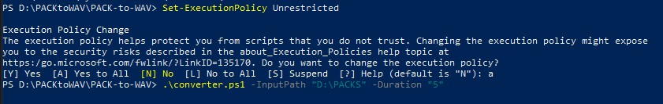
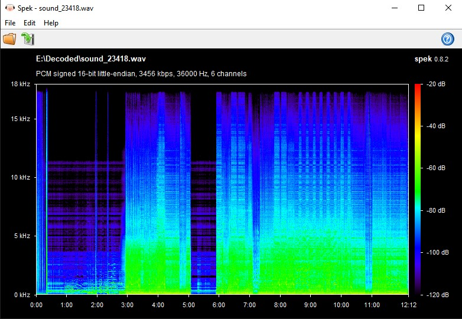

# PACK-to-WAV
Combination of free tools for .pack files extraction and decoding into wav audio format.
Works best (if you are lucky enough) with game files.

You can run script from context menu or by CLI.
1. Context menu: open Pack-to-WAV directory, then right click on converter.ps1 and select "Run with PowerShell" option. When the script starts running, select .pack files to extract. Extracted and decoded files are located in 'Decoded' dir.
2. CLI: open PowerShell program. Use cd command to change directory to Pack-to-WAV. \
Run: **.\converter.ps1 -InputPath < path to extract > -Duration < number of seconds >** \
Parameters are optional. Remember to use **Set-ExecutionPolicy Unrestricted**, to be able to run ps script.

CLI parameters:
- InputPath - [string] path to a directory that contains .pack files;
- Duration - [string] (in seconds) parameter says that every decoded music file, wich duration is shorter than the parameter value, will be deleted while the script is running.

Whole process can take long time and it depends on how big the .pack file is. A 1GB .pack file can contain several thousands of compressed files, so be prepared. Also thats why i added 'Duration' parameter, so you could filter/remove very small junk files (unless they are what you are looking for).

After the script has finished, you should see directory named 'Decoded'. Your files are inside. Now you can check if they are properly working and their quality. I recommend you a tool named "Spek". It allows you to draw spectogram of your audio.

As you can see, the audio file that was extracted may have originally been compressed, because there is a great cut off at 18kHz. It is also possible that decoding algorithm limited the bitrate to 18kHz. 